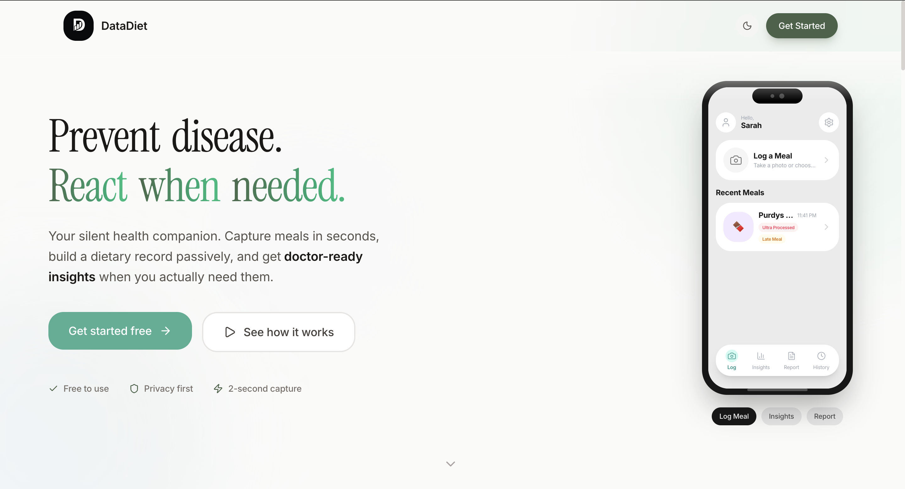

# DataDiet



**Your dietary black box for when health signals change.**

Capture meals effortlessly. Surface medically-relevant patterns. Generate doctor-ready reports in seconds.

---

## The Problem

When cholesterol spikes, gut issues emerge, or blood pressure rises, doctors ask: *"What have you been eating?"*

Most patients can't answer accurately. And existing diet apps don't help — they're built for weight loss, not clinical insight.

**DataDiet tracks what matters medically:**
- Microplastic exposure from plastic bottles and heated containers
- Processed and ultra-processed food consumption
- Carcinogenic cooking methods (charring, high-heat frying)
- Meal timing and circadian disruption
- GI irritants and triggers

---

## Features

### Meal Logging
- **Snap & forget** — Take a photo, AI handles the rest
- **Smart analysis** — Gemini 3 Flash identifies foods, portions, and health flags
- **Zero friction** — No calorie counting, no guilt

### Dietary Intelligence
- **Pattern detection** — Track plastic exposure, processed meat intake, late meals
- **Insights dashboard** — Visualize trends over days, weeks, months
- **AI chat** — Ask questions about your dietary history ("What might have caused my stomach issues yesterday?")

### Clinical Output
- **One-page reports** — Professional summaries ready for your doctor
- **Blood work integration** — Correlate diet patterns with lab results
- **PDF export** — Share or print for appointments

---

## Platform Availability

| Feature | iOS App | Web App |
|---------|:-------:|:-------:|
| Meal photo capture | ✓ | ✓ |
| AI food analysis | ✓ | ✓ |
| Health flag detection | ✓ | ✓ |
| Insights dashboard | ✓ | ✓ |
| Blood work input | ✓ | ✓ |
| AI diet chat | — | ✓ |
| Doctor reports | ✓ | ✓ |
| PDF/HTML export | ✓ | ✓ |
| Google sign-in | — | ✓ |
| Real-time sync | ✓ | ✓ |

---

## Health Flags Tracked

DataDiet's AI detects patterns that matter clinically:

| Category | Flags | Why It Matters |
|----------|-------|----------------|
| **Plastics** | `plastic_bottle`, `plastic_container_hot` | Microplastic & BPA exposure |
| **Carcinogens** | `processed_meat`, `charred_grilled` | WHO Group 1 carcinogens, HCAs/PAHs |
| **Processing** | `ultra_processed`, `fried` | Metabolic syndrome, inflammation |
| **Timing** | `late_meal` | Circadian disruption, sleep quality |
| **Metabolic** | `high_sodium`, `high_sugar_beverage` | Blood pressure, diabetes risk |
| **Stimulants** | `caffeine`, `alcohol` | Sleep, gut, liver effects |
| **GI Triggers** | `spicy_irritant`, `acidic_trigger` | GERD, IBS management |

See [RESEARCH.md](./iosapp/RESEARCH.md) for the scientific evidence behind each threshold.

---

## Tech Stack

**iOS App** (`/iosapp`)
- Expo + React Native
- Firebase (Auth, Firestore, Storage)
- Google Gemini 3 Flash Preview
- React Native Reanimated

**Web App** (`/webapp`)
- Next.js 15 + TypeScript
- Tailwind CSS v4
- Firebase (Auth, Firestore)
- Google Gemini 3 Flash Preview
- Framer Motion

---

## Quick Start

### Prerequisites
- Node.js 18+
- Firebase project with Auth, Firestore, and Storage enabled
- Google AI API key (Gemini)

### iOS App

```bash
cd iosapp
npm install
```

Create `.env`:
```env
EXPO_PUBLIC_GEMINI_API_KEY=your_gemini_key
EXPO_PUBLIC_FIREBASE_API_KEY=your_firebase_key
EXPO_PUBLIC_FIREBASE_AUTH_DOMAIN=your_project.firebaseapp.com
EXPO_PUBLIC_FIREBASE_PROJECT_ID=your_project_id
EXPO_PUBLIC_FIREBASE_STORAGE_BUCKET=your_project.firebasestorage.app
EXPO_PUBLIC_FIREBASE_MESSAGING_SENDER_ID=your_sender_id
EXPO_PUBLIC_FIREBASE_APP_ID=your_app_id
```

```bash
npx expo start
```

### Web App

```bash
cd webapp
npm install
```

Create `.env.local`:
```env
NEXT_PUBLIC_GEMINI_API_KEY=your_gemini_key
NEXT_PUBLIC_FIREBASE_API_KEY=your_firebase_key
NEXT_PUBLIC_FIREBASE_AUTH_DOMAIN=your_project.firebaseapp.com
NEXT_PUBLIC_FIREBASE_PROJECT_ID=your_project_id
NEXT_PUBLIC_FIREBASE_STORAGE_BUCKET=your_project.firebasestorage.app
NEXT_PUBLIC_FIREBASE_MESSAGING_SENDER_ID=your_sender_id
NEXT_PUBLIC_FIREBASE_APP_ID=your_app_id
```

```bash
npm run dev
```

Open [http://localhost:3000](http://localhost:3000)

---

## Project Structure

```
DataDiet/
├── iosapp/                 # iOS app (Expo + React Native)
│   ├── src/
│   │   ├── screens/        # App screens
│   │   ├── components/     # Reusable components
│   │   ├── services/       # Firebase, Gemini, meals
│   │   └── context/        # Auth, theme, onboarding
│   └── RESEARCH.md         # Scientific evidence base
│
├── webapp/                 # Web app (Next.js)
│   ├── src/
│   │   ├── app/            # Next.js app router
│   │   │   └── app/        # Authenticated pages
│   │   ├── components/     # UI components
│   │   ├── services/       # API integrations
│   │   └── context/        # React contexts
│   └── public/
│
└── README.md
```

---

## Design Philosophy

**Capture, don't track.** Minimal friction. No calorie guilt. Just a long-term dietary record.

**Track what matters.** Not macros — plastics, carcinogens, timing, and processing.

**Serve the clinical conversation.** One-page reports that give doctors actionable patterns.

**Preventive + reactive.** Useful for building healthy habits and investigating health changes.

---

## License

MIT
